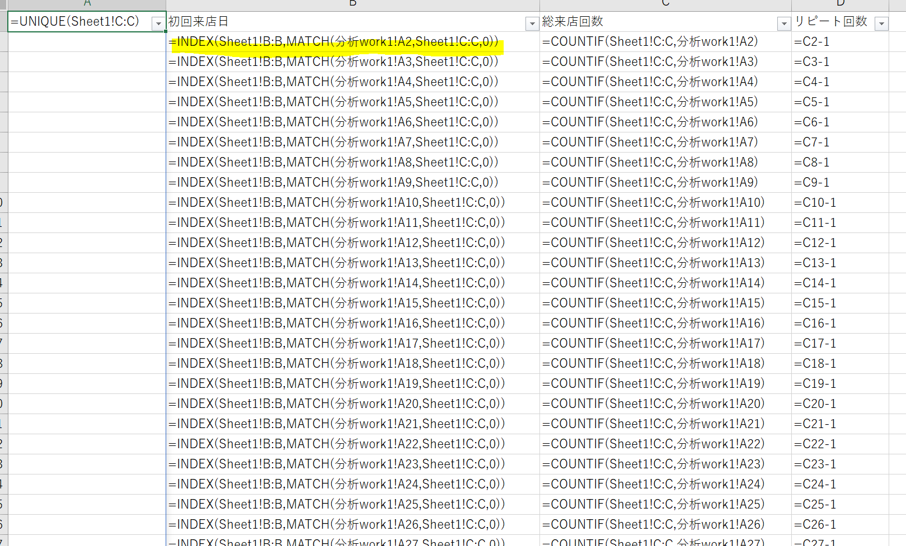

# [ユースケース]リピーターを算出する

## 状況
### ユースケース
* 来店記録から、初回来店人数とリピーター率を計算する

### 元ネタと期待値

* 元ネタとしては、来店した人、日付をただ羅列しただけの、来店記録シートで、来店通番、来店日、顧客ID、顧客名が情報としてあるとする。イメージとしては以下。

[来店記録.xlsx](./来店記録.xlsx)

* この来店記録から、来店傾向を調べたく、来店人数の推移だけでなく、初回来店とリピータがどれだけきているのかみたい
  * 初回来店が多い＝まだ新規顧客を呼び込める可能性が高い
  * リピーターが多い＝リピータがついてきてくれている。少なければ、再訪の魅力がない店だと思われてしまってるので改善が必要。
  

[機体結果.xlsx](./期待結果.xlsx)

## どうやるか
### 作戦
* 単純な来店人数は、日付列挙のcountifで算出できる
* 初回来店は、すこしややこしいが、ユニークユーザの一覧があれば、各ユーザの初回登場日は出せそう。
  * ユニークユーザはどうやって出そうか。Excelのバージョンが新しければスピル関数が使えるので、UNIQUEで行けそうだ。
* リピーターはまじめにやるとだいぶ大変になりそう。ここは人数わかればいいので、来店人数ー初回来店の引き算で計算することで簡単に導く。

### 分析をやる
* まず、ユニークユーザの一覧を作る。UNIQUE関数を使って、顧客IDのユニーク一覧を生成させる

* 1行書くと、後続行に続いてくれる便利な関数。ここでは顧客IDの一覧をユニークで出している。

* 次に、ユニークユーザの初回来店日を調べる。
  * これには、よくつかうvlookupもしくはINDEX+MATCHで、最初に見つけた行のセル情報をとってくる関数を使う
  * 今回は、元ネタの並び順が、id,来店日,顧客ID,顧客名で、行をひっかけるキーが顧客ID、ほしい情報が来店日と順番が逆になっていて、そのままだとvlookupはつかえないので、INDEX+MATCHを使うことにする

* 適用させるとこんなかんじで、初回来店日がわかる

* さて、あとは簡単で、各日付の来店総人数をCOUNTIFで計算し、先ほど計算した初回来店もCOUNTIFで日付事に何人か計算し、来店人数ー初回来店人数でリピーター人数を計算する。

* 

* 結果はこんなかんじで、期待値と同じ結果がだせた。
* 

実際の分析ファイルはこんなかんじ
[./来店記録分析.xlsx](./来店記録分析.xlsx)
